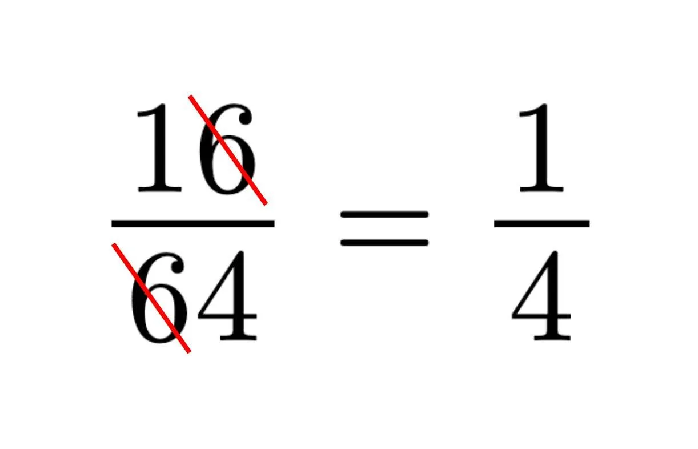
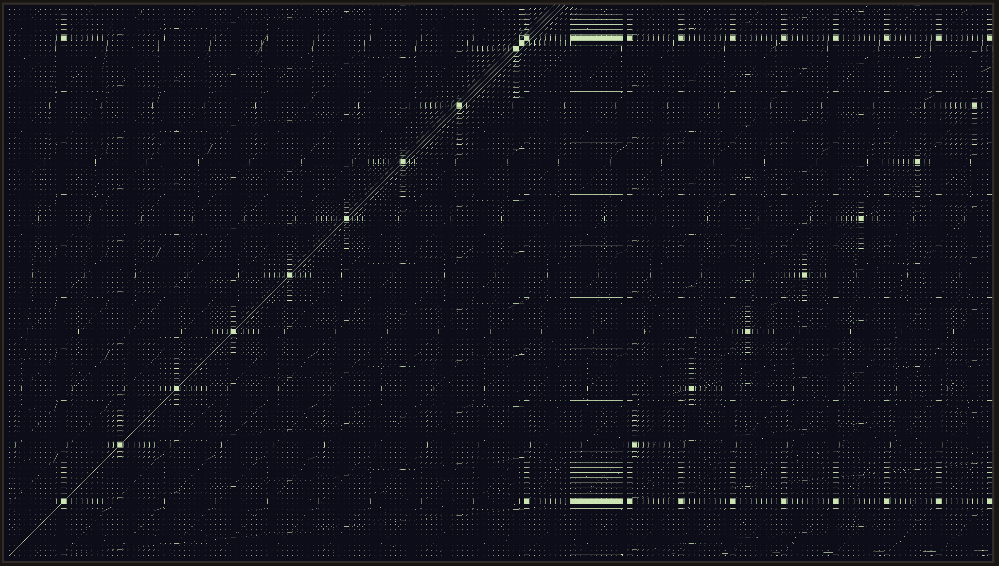

# About

This is a program I made to visualize this meme in OpenGL 3.3



# How it looks



# Compile

```console
$ cc -o main main.c src/glad.c-I./include -lX11 -lXrandr -lGL
```

# Run

```console
$ ./main
```
